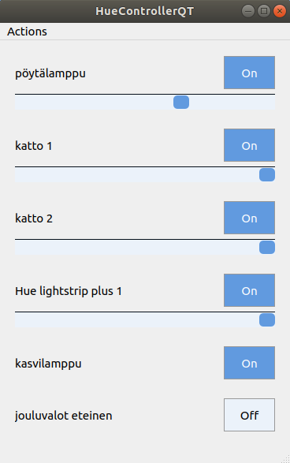

# HueControllerQT

```HueControllerQT``` is a minimalist implementation of a desktop application written in ```C++``` and ```QT``` that you can use to control you Philips Hue smart lights through the Hue bridge. 


<div style="display: flex; flex-direction: row; justify-content: center;">
    
</div>

## Packaging

See package.sh which implements required steps for packaging our application. It currently:

- Downloads the QT libraries and compiles them as static libraries.
- Build our app as static app linked agains the built QT libraries.
- Add the built app 'HueControllerQT' to installation directory
- Create a HueControllerQT.tar at the project root.

This has steps following instructions at
1. https://wiki.qt.io/Building_Qt_5_from_Git
2. https://doc.qt.io/qt-5/linux-deployment.html

NOTE: Building all the libraries will take some time...

## Installation

After building the application by using package.sh, a statically linked application binary should be under 'install' directory. To install the app on your system

```bash
cd install
./install.sh
```

This copies the app binary under ```/usr/local/bin``` and creates a autorun entry at ```~/.config/autorun/HueControllerQT.desktop```. This will automatically start the app on startup.


## General api description

Mainwindow has HueApi.

Api owns light objects and emits light events.

Mainwindow can set the state of different lights directly from the instantiated Light objects or through LightWidget->Light.

Light objects just call their HueApi instance to actually modify the light state.

HueApi tries to perform the api action by sending a POST request to the Hue Bridge.

On succeed, HueApi updates all of its light objects and then emits LightsUpdated event. MainWindow listens to this event.


